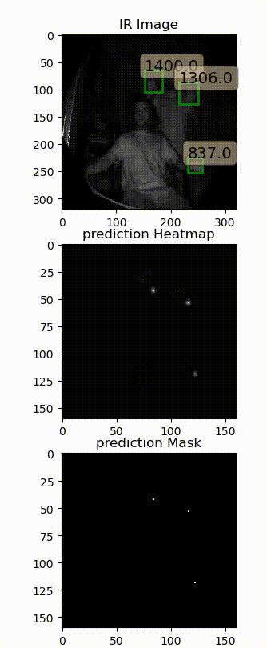
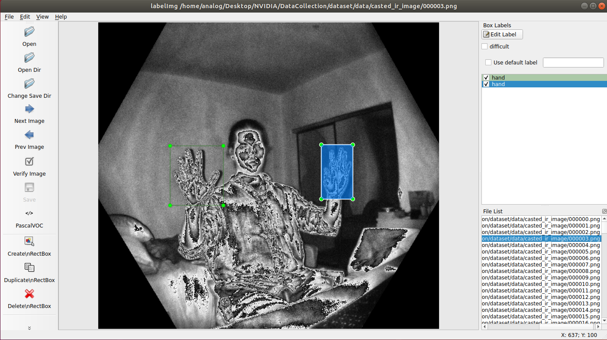
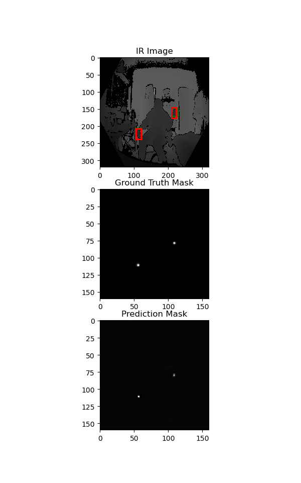

# centernet_kinect

This repository demonstrates how to set up [**Azure Kinect** camera](https://azure.microsoft.com/en-us/services/kinect-dk/) with your Jetson platform, collect and annotate data, train a object ddetection model with the collected data, and finally run a real time object detection model on your development kit. <br/>

* [Install Sensor SDK on Jetson](#install_sensor_sdk)
  * [Install python packages](#install_python_packages)
  * [Get pretrained weights](#get_pre_trained_weights)
* [Collect/Annotate Data](#collect_annotate_data)
  * [Data collection](#data_collection)
  * [Annotate data](#data_annotation)
* [Train Model](#train_model)

<p align="center">

</p>
<a name="install_sensor_sdk"></a>
## Install Sensor SDK on Jetson

**Note** in this tutorial we will be installing the SDK on Ubuntu Version *18.04.5 LTS"*.<br/>

To check your distribution/version you can run the following command
```bash
cat /etc/os-release
```
Here is the [link](https://packages.microsoft.com/) to microsoft package repository in case you are using any other distribution/version.<br/>
Here are more instructions on how to configure and install the SDK on other platforms [Link](https://docs.microsoft.com/en-us/windows-server/administration/linux-package-repository-for-microsoft-software) <br/>


### 1. Add Microsoft's product repository for ARM64
```bash
curl https://packages.microsoft.com/keys/microsoft.asc | sudo apt-key add -
sudo apt-add-repository https://packages.microsoft.com/ubuntu/18.04/multiarch/prod
sudo apt-get update
```

### 2. Install Kinect Package
```bash
sudo apt install k4a-tools
sudo apt install libk4a1.4-dev
```

### 3. Setup udev rules
- in order to use the Azure Kinect SDK with the device and without being 'root', you will need to setup udev rules [Link](https://github.com/microsoft/Azure-Kinect-Sensor-SDK/blob/develop/docs/usage.md#linux-device-setup)

- Copy '[scripts/99-k4a.rules](https://github.com/microsoft/Azure-Kinect-Sensor-SDK/blob/develop/scripts/99-k4a.rules)' into '/etc/udev/rules.d/'.
- Detach and reattach Azure Kinect devices if attached during this process.

### 3. Setup udev rules
- test the SDK
```bash
k4aviewer
```

**Note** Here are more instuctions if you were experiencing dificulty with yout setup [Link](https://gist.github.com/madelinegannon/c212dbf24fc42c1f36776342754d81bc#updating-firmware-for-azure-kinect)

<a name="install_python_packages"></a>
## Install python packages

- install python pip
```bash
sudo apt update
sudo apt-get install python3-pip
```
- install torch 1.7.0. Here is the [Link](https://forums.developer.nvidia.com/t/pytorch-for-jetson-version-1-7-0-now-available/72048) to choose the correct versions.
```bash
wget https://nvidia.box.com/shared/static/wa34qwrwtk9njtyarwt5nvo6imenfy26.whl -O torch-1.7.0-cp36-cp36m-linux_aarch64.whl
sudo apt-get install python3-pip libopenblas-base libopenmpi-dev 
pip3 install Cython
pip3 install numpy torch-1.7.0-cp36-cp36m-linux_aarch64.whl
```
- install torch vision 0.8.1
```bash
sudo apt-get install libjpeg-dev zlib1g-dev libpython3-dev libavcodec-dev libavformat-dev libswscale-dev
git clone --branch v0.8.1 https://github.com/pytorch/vision torchvision
cd torchvision
export BUILD_VERSION=0.8.1  # where 0.8.1 is the torchvision version  
sudo python3 setup.py install
cd ../  # attempting to load torchvision from build dir will result in import error
pip3 install 'pillow<7' # always needed for Python 2.7, not needed torchvision v0.5.0+ with Python 3.6
```
- install requirments
```bash
pip3 install -r requirments.txt
```

<a name="get_pre_trained_weights"></a>
## Get pretrained weights

- get the pretrained weight from the following [link](https://drive.google.com/file/d/19a0ooi8GI-vxm5cAXvCS7O_5ylOeuR0g/view?usp=sharing) and place the file in:
```bash
cp DOWNLOADED_WEIGHTS PATH/TO/PROJECT/checkpoint/Logistic_ResnetCenterNet_fused.pth
```

<a name="collect_annotate_data"></a>
## Collect/Annotate Data

We will discuss data collection and annotation in this section<br/>
<a name="data_collection"></a>
### 1. Data collection
- Setup **JSON_ANNOTATION_PATH** and **SAVE_DATASET_PATH** in *pipeline/constants.py* file 
  - **SAVE_DATASET_PATH** setups the location to save the dataset. here is how the dataset directory hierarchy is setup
  by defaul it is set to *PATH/TO/PROJ/annotation_json/*
  ```bash
  data
    ├── annotation
    ├── casted_ir_image
    ├── depth_image
    ├── ir_image
    └── rgb_image
  ```
  - **JSON_ANNOTATION_PATH** setups the location to store the annotation json files to train the model (i.e train.json, val.json)
  these files will be created after parsing the annotation (.xml) files.
  by defaul it is set to *PATH/TO/PROJ/annotation_json/*
  ```bash
  {"img_path": "/path/to/image.png",
  "chw": [1, 576, 640],
  "boxes": [[345, 191, 384, 235], [424, 185, 467, 223], [309, 401, 341, 430], [152, 430, 198, 483]],
  "labels": [1, 1, 1, 1]}
  ```
<a name="data_annotation"></a>
### 2. Annotate data
- We used [labelImg](https://pypi.org/project/labelImg/) to annotate out dataset. you can install and run by running teh follwoing command
```bash
pip install labelImg
labelImg
```
- Open the *DATASETPATH/data/casted_ir_image* directory to load images and set the *Save Dir* to *DATASETPATH/data/annotation* and start annotating
<p align="center">

</p>

- When finished with annotating the data you need to parse the Pascal VOC format and create json files containging annoation information. run *pipeline/parse_pascal.py* to create 
  - label_map.json
  - train.json
  - val.json

<a name="train_model"></a>
## Train Model

Having the dataset ready We need to train the model (it is recomended to collect and annotate over 3k images for better performance). <br/>

### 1. setup training parameters
- **CHECKPOINT_PATH** the path to save the model checkpoints (default *PATH/TO/PROJ/checkpoint)
- you can set the to either train with only depth images or with ir and depth fused images (*setup in pipeline/constants.py*)
  - depth input images: image size (3, 300, 300) dublicate the image for all the 3 input channels 
  - fused input images: channel1 ir images, channel 2 depth image, channel 3 mean of the first 2 channels
- loss functions: you can either use Logistic or MSE loss for the heatmap regression (*setup in pipeline/constants.py*)
- setup max epoch in pipeline/constants.py*
- Model naming convention: *LossFunc_ModelName_dataType.pth* (i.e *Logistic_CenterNet_fused.pth* or *Logistic_CenterNet_depth.pth*)

### 2. train
run training by
```bash
python3 train # To start training a model from scratch

python3 train -r True # To continue an already trained model
```
### 3. visualize from checkpoint
run training by
```bash
python3 visualization.py # To run inference on a validation image
```
<p align="center">

</p>


### 4. run real time inference
run training by
```bash
python3 azure_kinect.py # To run real time inference
```
